# Cloudera Agent Studio Hands On Lab

July 1st, 2026

**WELCOME!**

This document will be your exercise guide and will contain all information about the Labs, except for Links to the environment and passwords.

These can be found in the chatbox of the meeting.


# Before You Begin

This lab is instructor guided. Please follow along with your instructor. 

Every lab is independent. If you don’t manage to complete one it will not stop you completing the rest. If you need help please raise your hand and an instructor will assist you. 

To review this lab at home with click by click directions please check out our guided tour: https://app.getreprise.com/launch/W6G3ON6/


# Getting Started

**Goals**

- [ ] Login to Cloudera Control Plane
- [ ] Launch Cloudera AI Agent Studio Application

## Launching Agent Studio

Login to the Cloudera on cloud tenant using the details provided by your instructor.

After login you should see the Cloudera tenant Home Screen. Click on **Cloudera AI**

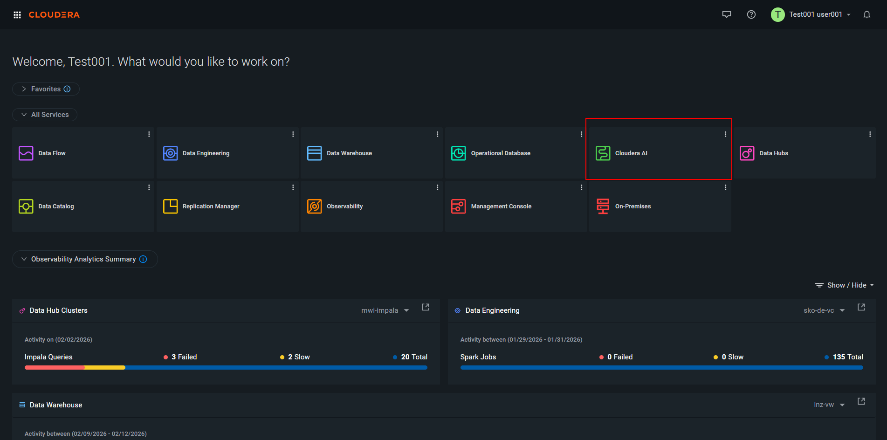

From the earlier step, you were give the workspace. Makes you pick the right workspace.
Click into the desired workspace. (only 1 for this lab)


From the earlier step, you were given the workspace. Makes you pick the right workspace.

Click into the workspace based on your username. Please, do not select any other workbench as this could disturb the workload management.  

user 001 to user030 -> aihol-ml-wb01


user 031 to user060 -> aihol-ml-wb02


user061 to user090 -> aihol-ml-wb03


user091 to user120 -> aihol-ml-wb04


<br/>

<br/>

Click **view all projects** and select scope to **My Teams Projects**


<br/>
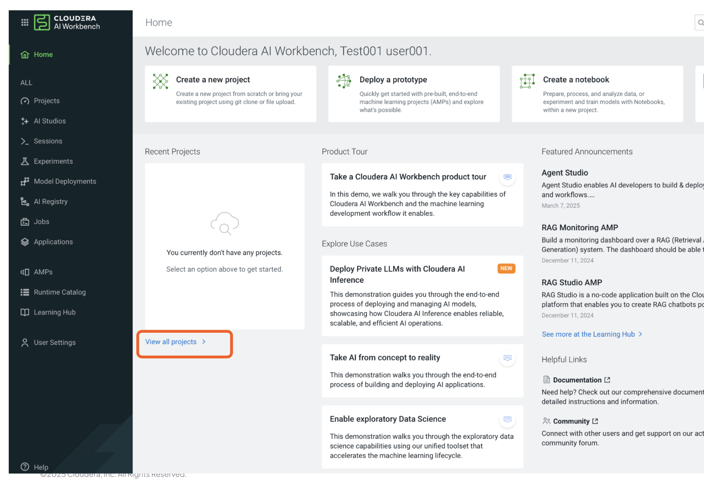
<br/>


<br/>
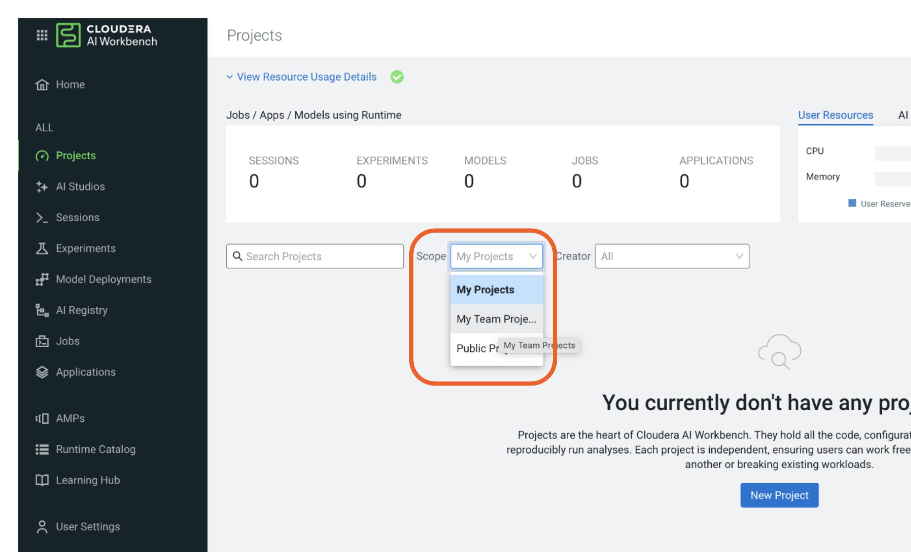
<br/>
You will see your project. Click into it. 


<br/>
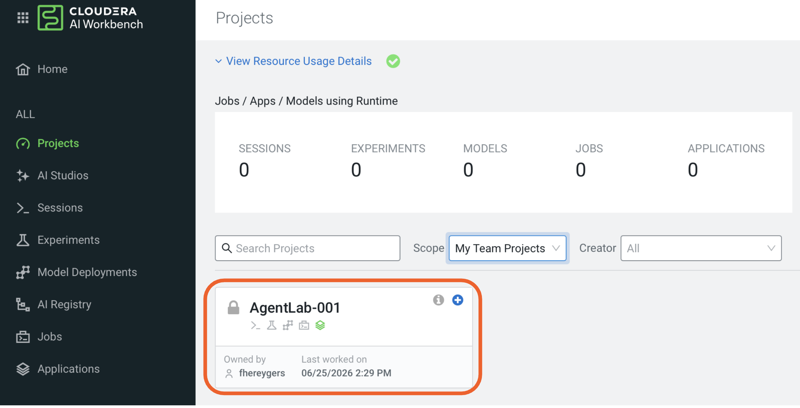
<br/>

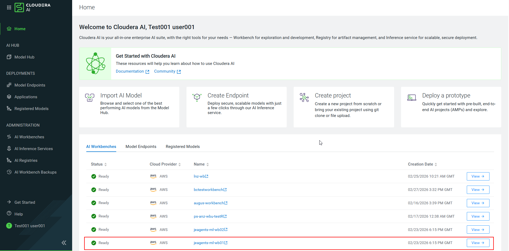

You will see your assigned Cloudera AI project. Click on the project name to open it.

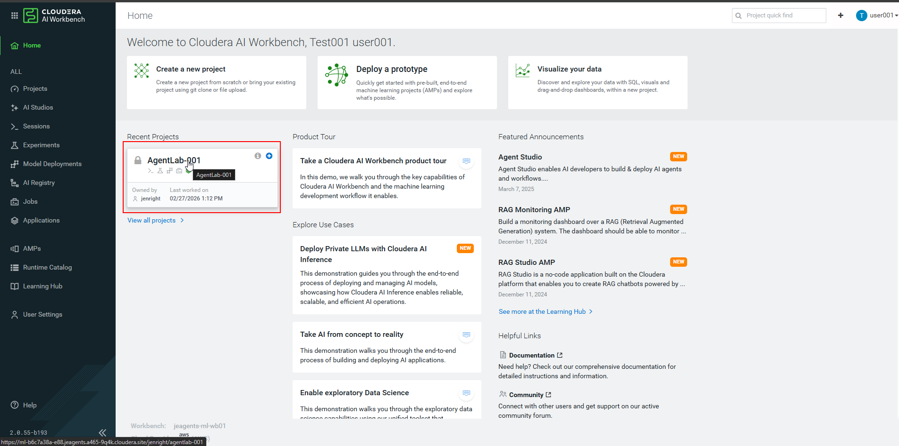

In the Project on the left navigation pane, click `AI Studios -> Agent Studio` to open Agent Studio application.

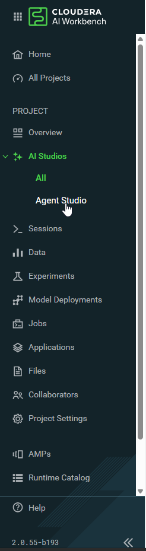

In the application, check the option _Don't show me this again_ and Click *Get Started*

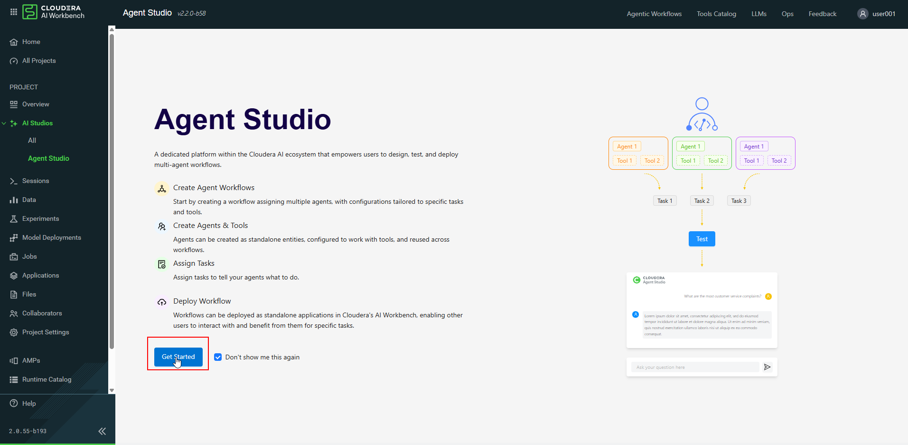

### Checklist

- [x] Are you able to connect to the Cloudera Control Plane?
- [x] Are you able to navigate to and open your assigned Cloudera AI project?
- [x] Were you able to access the Agent Studio application?

**:rocket: You are now set up and ready to start building Agents! :rocket:**


# Lab 1 - Building a Financial Calculation Agent

In this lab, you'll quickly deploy a financial modeling agent in Cloudera AI Agent Studio. You will assign complex tasks and observe how agents break down logic into step-by-step thoughts and actions. Finally, you'll explore the _"poets vs. quants"_ phenomenon, witnessing firsthand the limitations of using standalone LLMs for precise mathematical computations.

**Goals**

- [ ] Build an agent in 10 mins
- [ ] Create an agent and task
- [ ] See limitations of using only agents

## Requirements

You must be logged into your assigned Cloudera AI project with the Agent Studio application launched. See [Lab 0 - Getting Started](../lab0/README.md) for setup instructions.

## Step-by-Step Guide

### Step 1: Create a New Workflow in Agent Studio

* Navigate to the Agent Studio for your assigned lab.

* On the Agent Studio home page, click `Create Workflow` to create a new workflow.

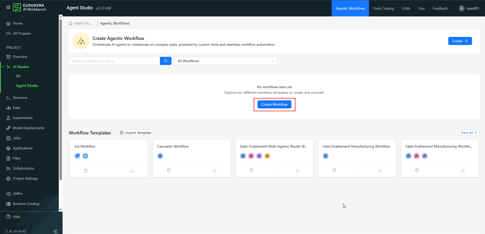

* Name it `Lab1: Calculate` in the workflow details.

* Click Create Workflow and proceed to the agent creation screen. 

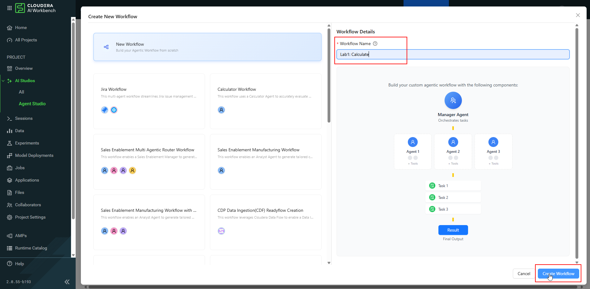

### Step 2: Generate Agent Properties with AI

* In the agent definition area, click `Create or Edit Agents`.

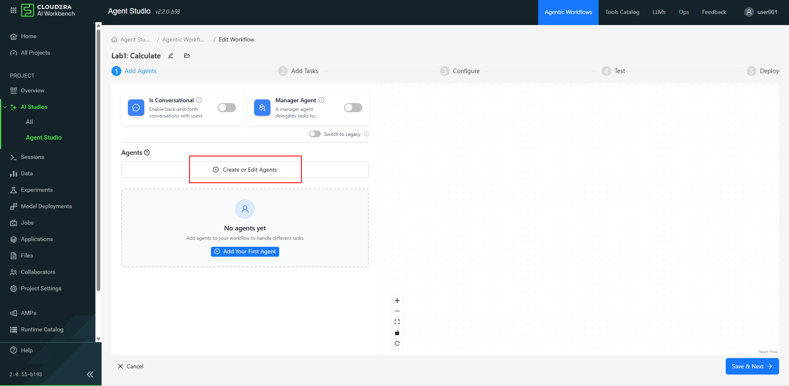

* Instead of manually typing the details, click the `Generate with AI` button to automatically create the agent's role, goal, and backstory.

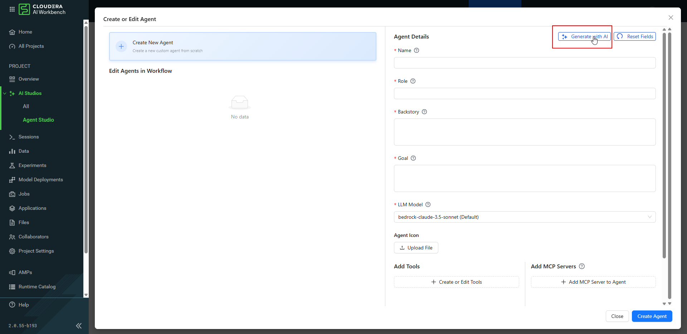

* Enter the following simple prompt into the AI generator: 

```text
You are an expert at calculating financial formulas.
```
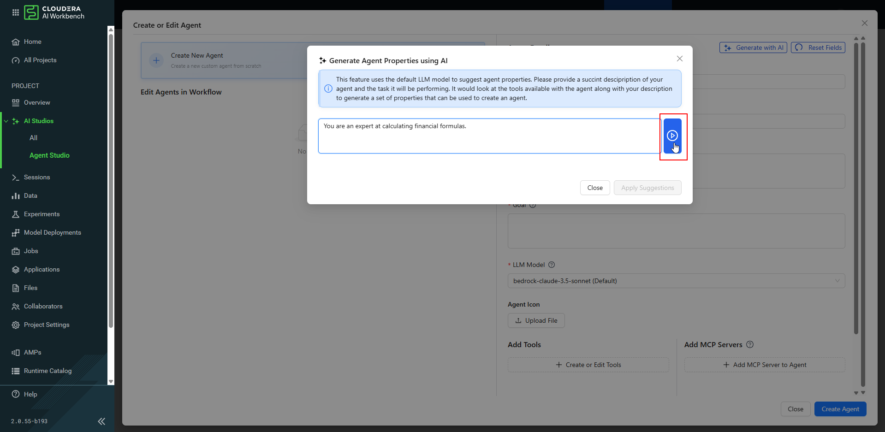

* Press the button to generate the properties. 

* Review the generated suggestions for Role, Goal and Backstory.

* Click `Apply Suggestions` to populate the agent detail boxes.

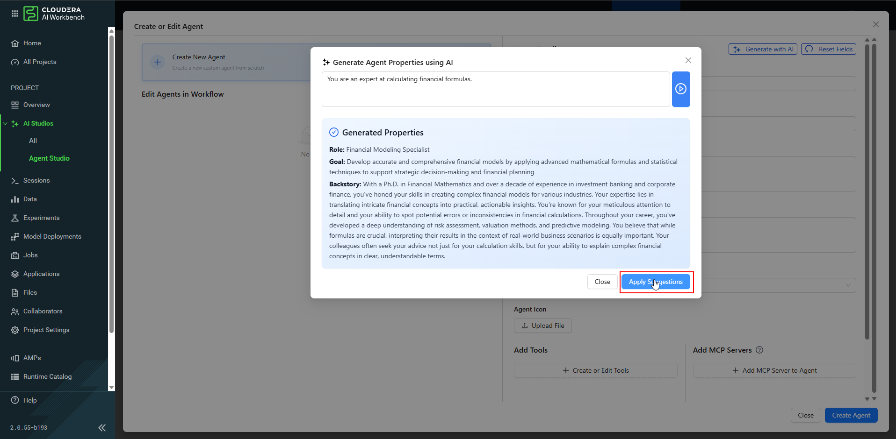

### Step 3: Finalize the Agent

* Select the specific LLM model assigned by your instructor.

* Click `Create Agent`. 

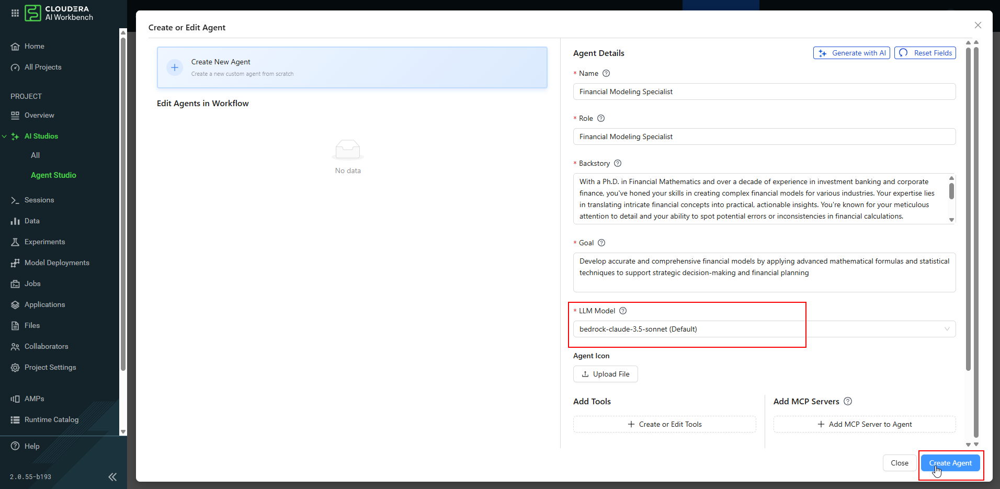

* Then close the Create or Edit Agent dialog box. 

* Then click `Save & Next`.

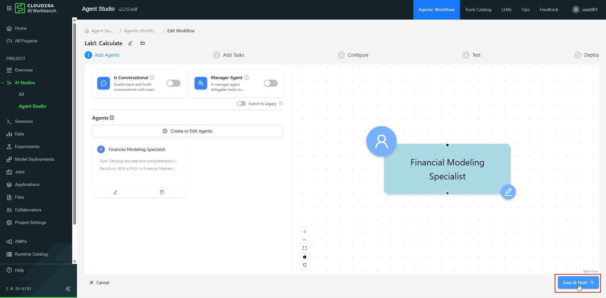


### Step 4: Add the Calculation Task

* Click the `Add Task` button.

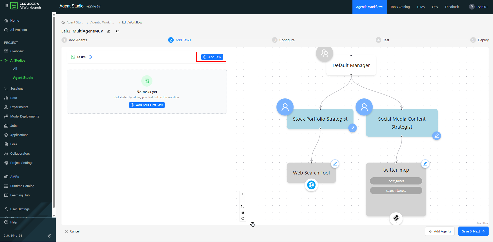

* In the task description, enter the following prompt. Note the use of curly braces for variables. 

```text
You calculate the NPV of a cashflow with the Future Value: {FV}, Time Period: {years}, and Discount Rate: {discount}. Show your work.
```


* Fill out the Expected output field.

```text
The steps to calculate the NPV and the final result.
```

* In the agent dropdown, select the Financial Modeling Specialist agent you created in the previous step.

* Click `Add Task`, then click Save & Next.

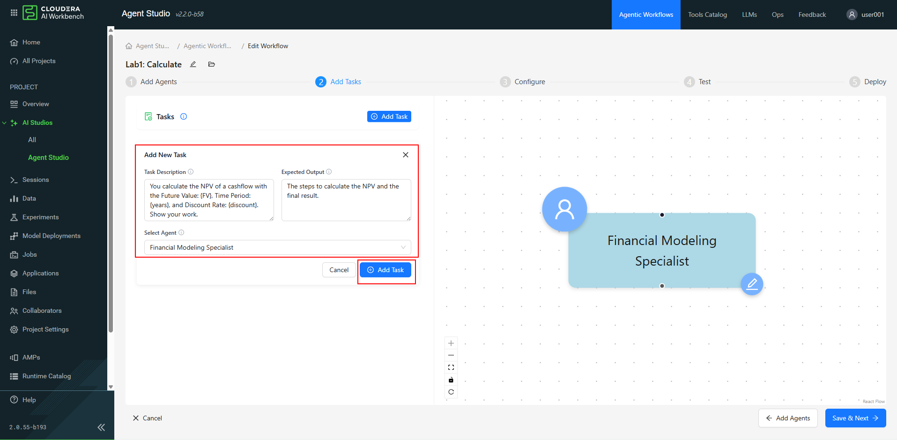

### Step 5: Review Configuration

* On the configuration screen, leave settings like tokens and temperature at their default values.

* Click Save and Next. 

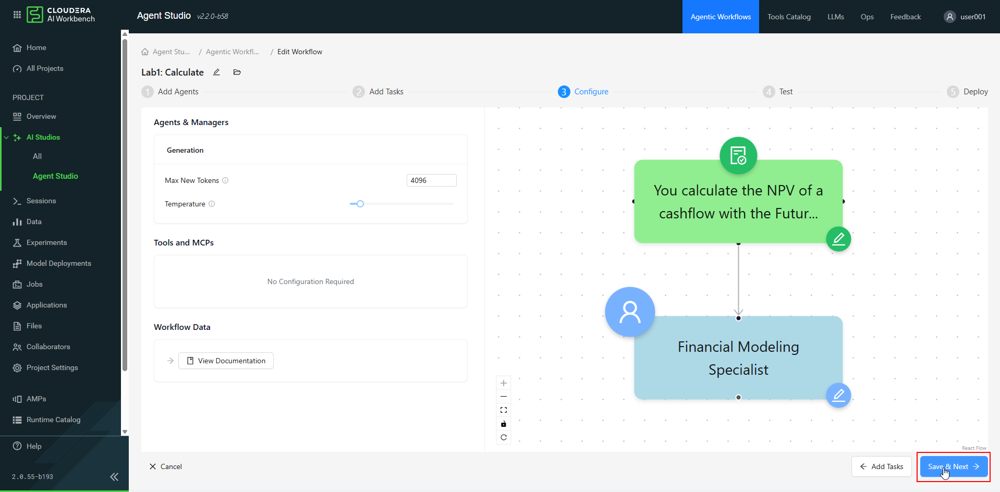

### Step 6: Test the Workflow

* On the test screen, fill in the input variables as follows:
   * Years: `4.5`
   * Discount: `6.5`
   * Future Value: `5000`

* Click Run Workflow.

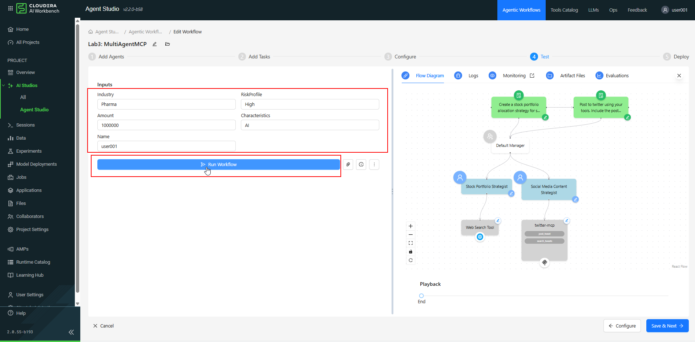

* Observe the output generated by the agent. 

You will see it break down the formula and perform a step-by-step calculation, resulting in an approximate value like $3,700. 

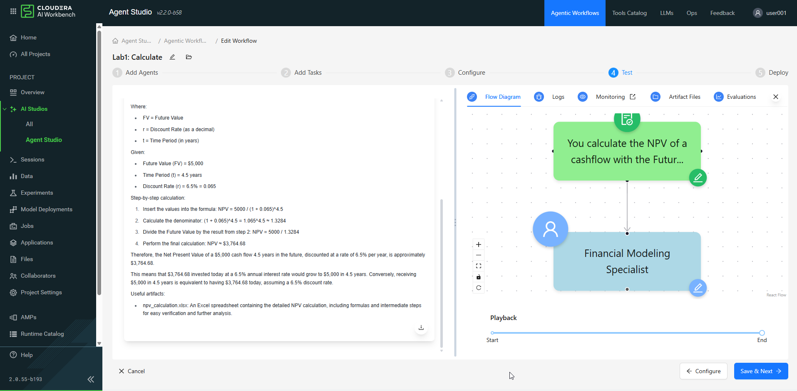

### Step 7: Validate Output and Review Limitations

* Open the [Present Value Calculator](https://www.calculator.net/present-value-calculator.html) tool in a new browser tab.

* Enter the same inputs:
   * Future Value = `5,000`
   * Number of Periods = `4.5`
   * Interest Rate = `6.5`

* Click `Calculate` and note the precise calculated present value: `$3,766.14`.

* Compare this true value with your agent's output. 

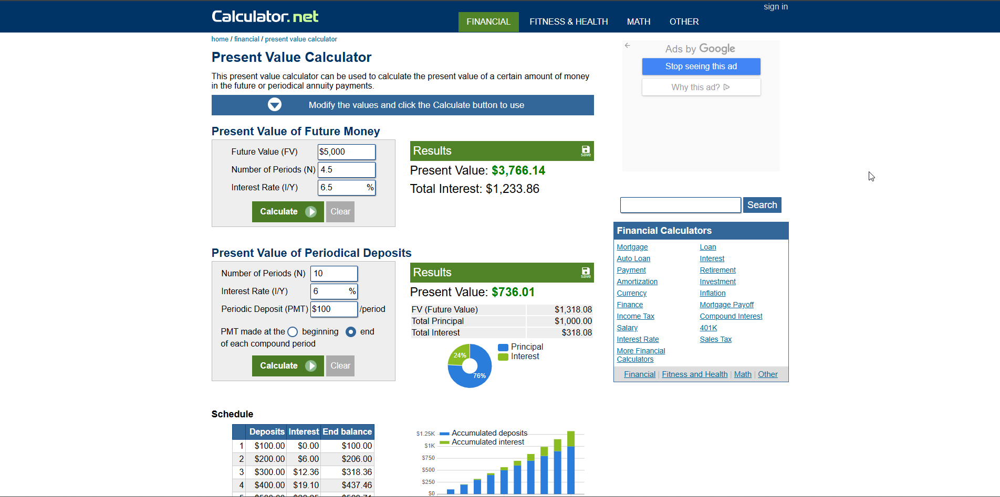

!!! info
      This discrepancy between the value calculated by the Agent and the external calculator tool demonstrates that while LLMs are excellent at decomposing the problem, they struggle with accurate decimals and rounding, highlighting the limitation of using LLMs for exact math.

### Step 8: Review Agent Studio Logs

* Return to Agent Studio and review the Logs to see the execution flow (crew started, task kicked off, LLM call completed) all happening within the LLM environment. 

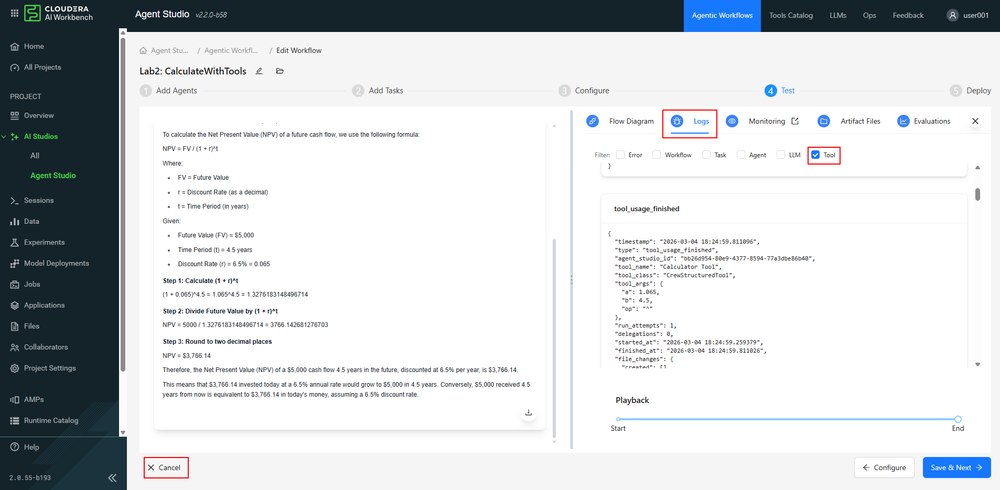

* You can click Cancel on the workflow creation, we will create a new workflow in the next lab.


**DO NOT DEPLOY ANY WORKFLOWS, OUR RESOURCES ARE TO LIMITED!**

**:rocket: We have now concluded Lab 1 :rocket:**


# Lab 2 - Integrating Tools in an Agent Workflow

In this lab, you'll address the limitations of LLM-model-only Agents by using tools into your AI workflows. You will use calculator tools and observe how the LLM uses problem decomposition to delegate complex math for flawless precision.

**Goals**

- [ ] Build an AI Agent workflow with tool calling capability.
- [ ] Enhance a tool to support custom calculator operations.
- [ ] Observe LLM reasoning and tool delegation.

## Requirements

You must be logged into your assigned Cloudera AI project with the Agent Studio application launched. See [Lab 0 - Getting Started](../lab0/README.md) for setup instructions.

## Step-by-Step Guide

### Step 1: Create a Workflow from a Template

* Navigate to the Agent Studio for your assigned lab.

* On the Agent Studio home page, go to the **Workflow templates** area and click `View All`.

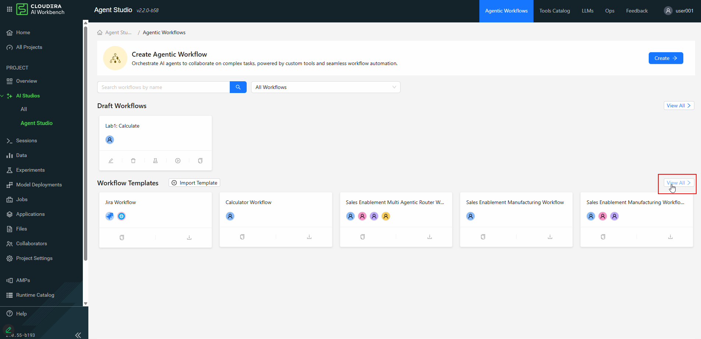

* Find and click the button for `Lab2: CalculateWithTools`

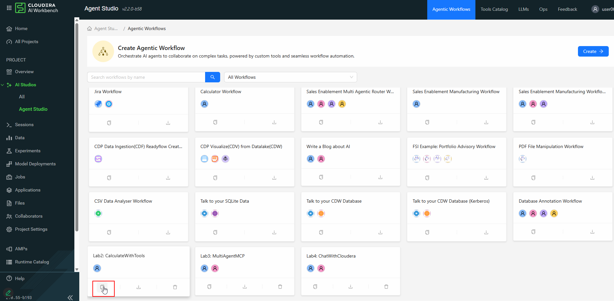

* This action will generate a draft workflow from the template as your starting point. 

### Step 2: Edit the Agent and Access Tools

* Locate the **Financial Modeling Specialist** that was created as part of the template and click Edit.

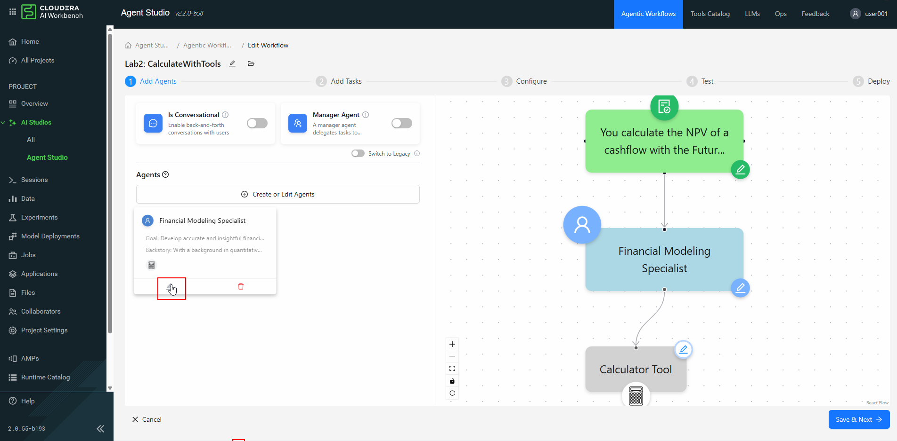

* In the **Create or Edit Agent** dialog, click the `Create or Edit Tools` button.

* Select the calculator tool from the menu. 

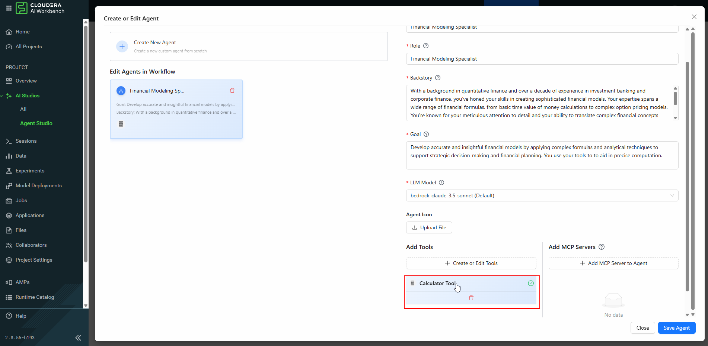

### Step 3: Modify `tool.py` to Add the Exponent Operator

* Click Edit on the tool details to open the files menu.


* Select and edit the tool.py file.

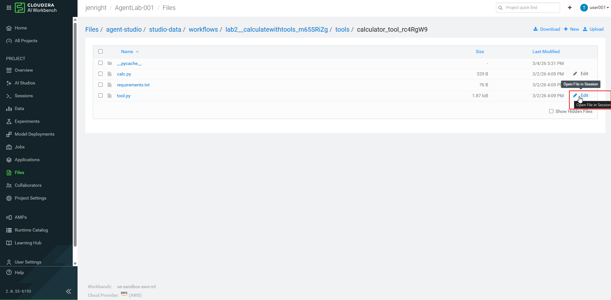

* Under the `ToolsParameters` class, locate the list of operators.

* Delete the comment hash (#) in front of the list of operators that includes the exponent symbol (the caret ^).

* Add a comment hash (#) to the old line of operators that does not include the exponent.

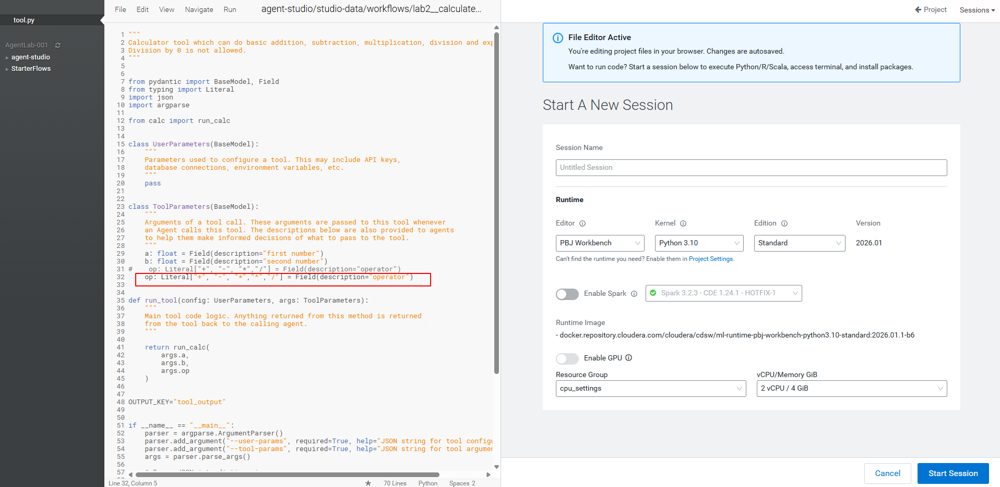

* The file auto-saves, but you can manually click `File > Save` to confirm.

* Click the Back button on your browser to return to the file list. 

### Step 4: Modify `calc.py` to Enable the Exponent Math

* Open and edit the `calc.py` file, which runs the actual calculation.

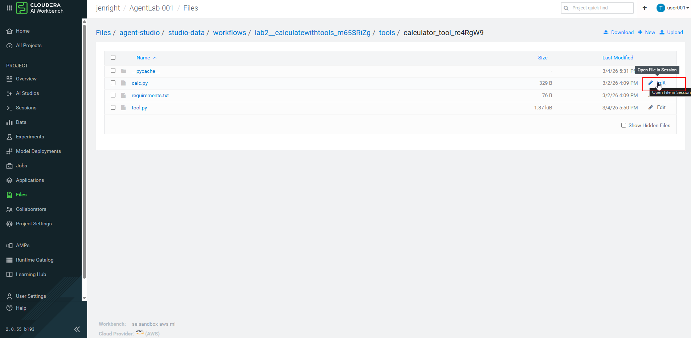

* Locate the two lines of code that dictate the action for the exponent (^) operator.

* Uncomment these two lines by deleting their hashes (#), ensuring that your indentation remains correct.

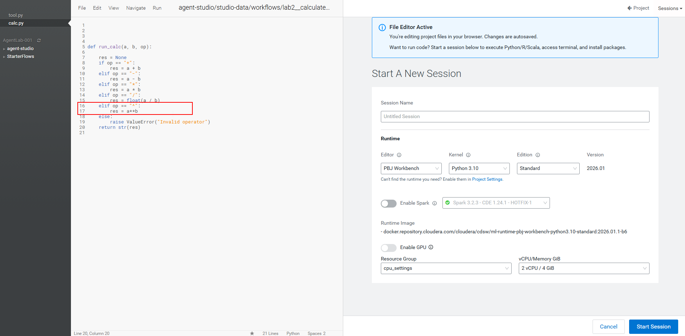

* Click `File > Save`, then close the file editor browser tab.

* Click the Refresh button in the Calculator Tool menu to apply your code changes. 

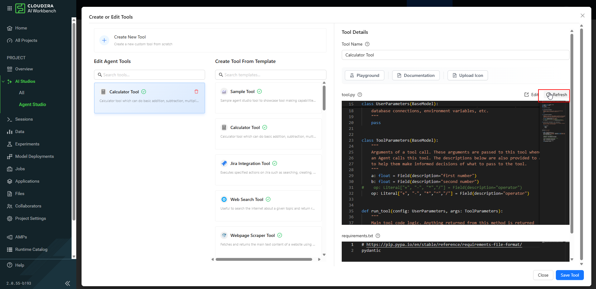

### Step 5: Test the Calculator Tool

* Click the Playground button to test the tool in isolation.

* In the tool parameters, input the following: 
   * A = `2`, 
   * B = `2`, and 
   * Operator = `^`.

* Click `Test Tool`. The tool will start, and the response should correctly output 4.

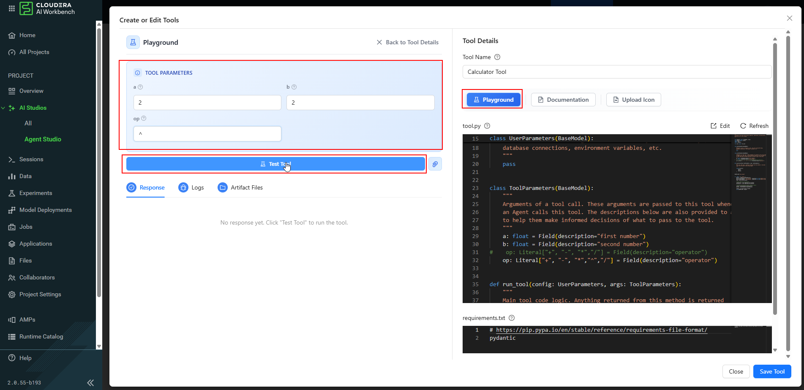

* Once verified, click `Save Tool` and then close the tool dialog.

* Similarly in the Create or Edit Agent dialog, click `Save Agent` and close the agent dialog.

* Click `Save & Next` on the Add Agents menu.

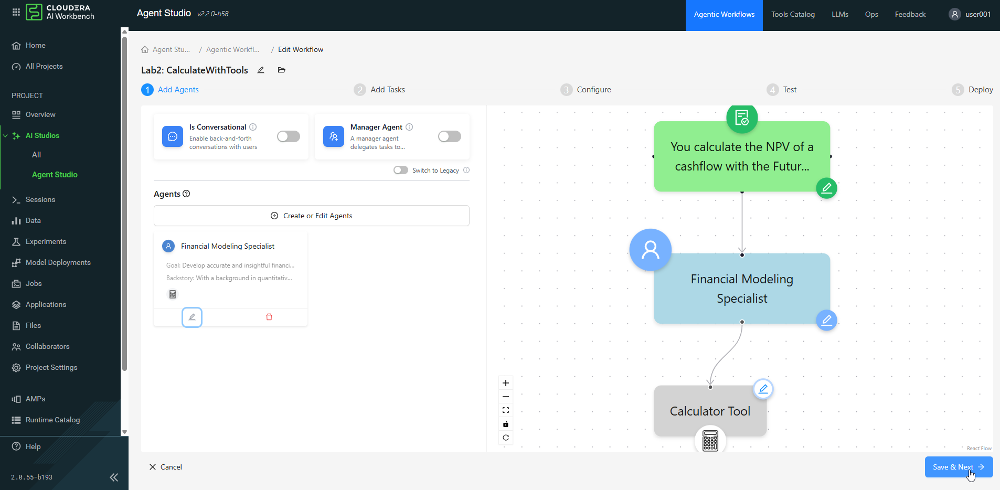

### Step 6: Review Task and Configuration

* Review the pre-populated task (which already includes the task description, expected output, and variable placeholders). 

* No changes are needed here. Click `Save & Next`.

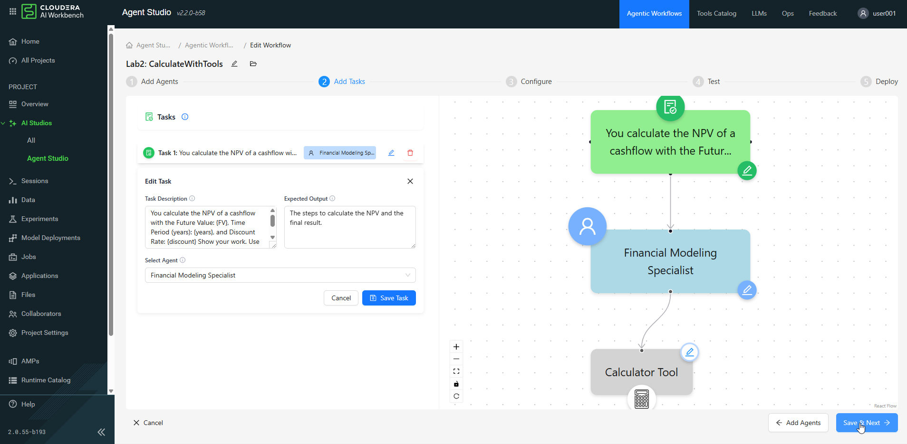

* On the configuration screen, leave the tokens and temperature settings at their default values and click `Save & Next`.


### Step 7: Test the Full Workflow

* On the test screen, input the same values used in Lab 1:
   * Years: `4.5`
   * Discount: `6.5`
   * Future Value: `5000`

* Click Run Workflow.

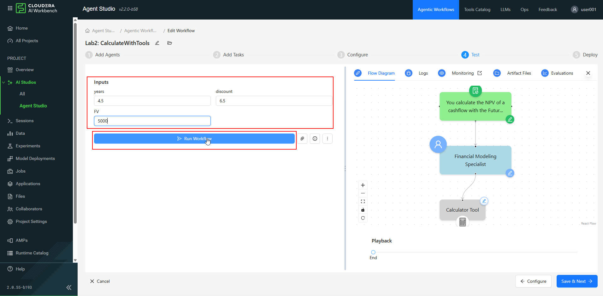

* Observe the output generated by the workflow. 

You will see the agent "thinking", extracting values, and calling the tool to perform the calculations. Verify the final result is exactly `$3766.14`, matching the precise calculator.net output. 

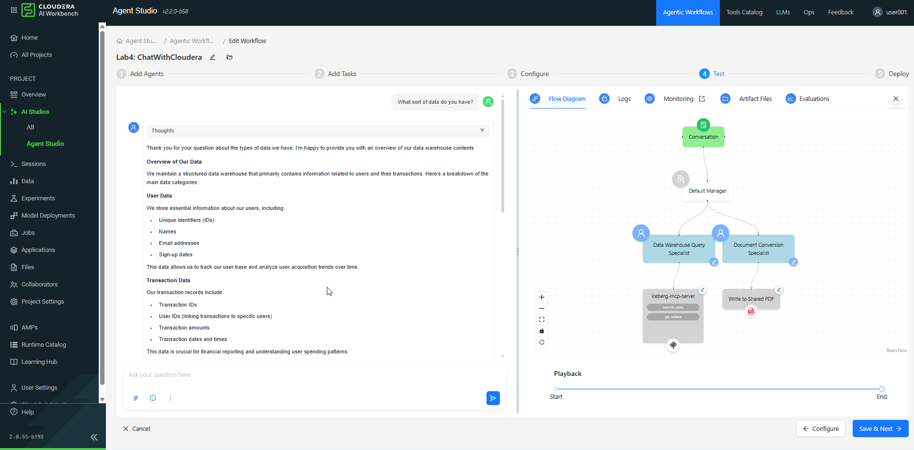

### Step 8: Review the Execution Logs

* Open the Logs tab and filter by **Tool** usage.

* Observe how the LLM first passed the inputs to the tool to calculate the exponent.

* Note how the tool passed the partial answer back to the LLM, which then called the tool a second time to perform the division calculation.

* Once satisfied, click Cancel on the workflow creation and return to the home screen (there is no need to deploy this lab).


**:rocket: We have now concluded Lab 2 :rocket:**


# Lab 3 - Chat with Cloudera

In this final lab, you will build a multi-agent team that bridges the gap between raw data and professional reporting by integrating **Cloudera Data Warehouse** via the **Cloudera Iceberg MCP server**. By orchestrating specialized agents to inspect schemas, execute SQL queries via Apache Impala, and synthesize findings into polished documents, you'll master the full lifecycle of data-driven agentic workflows.

**Goals**

- [ ] Build collaborative multi-agent workflows.
- [ ] Use an MCP server to connect agents to Cloudera Data Warehouse.
- [ ] Query data via Apache Impala and generate PDF reports.

## Requirements

You must be logged into your assigned Cloudera AI project with the Agent Studio application launched. See [Lab 0 - Getting Started](../lab0/README.md) for setup instructions.

Your instructor will provide you with connection details to connect to Cloudera Data Warehouse service.

## Step-by-Step Guide

### Step 1: Register the Iceberg MCP Server

* Navigate to the Agent Studio for your assigned lab.

* On the Agent Studio home page, click `Tools Catalog` on the top navigation.


* Click on the `MCP Servers` tab and then click `Register` to add a new MCP Server.

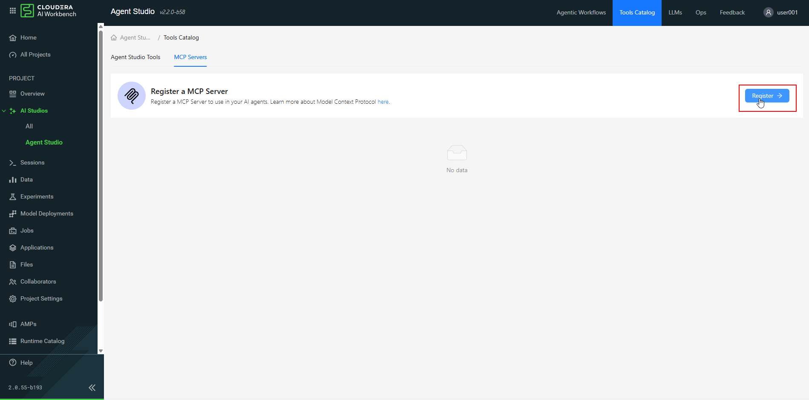

* In the **MCP Server Configuration** textarea, delete the placeholder text and paste the below configuration to register the [Cloudera Iceberg MCP Server](https://github.com/cloudera/iceberg-mcp-server?tab=readme-ov-file#option-1-direct-installation-from-github-recommended){target="_blank"}. Then click `Register`.

```json
{
  "mcpServers": {
    "iceberg-mcp-server": {
      "command": "uvx",
      "args": [
        "--from",
        "git+https://github.com/cloudera/iceberg-mcp-server@main",
        "run-server"
      ],
      "env": {
        "IMPALA_HOST": "coordinator-default-impala.example.com",
        "IMPALA_PORT": "443",
        "IMPALA_USER": "username",
        "IMPALA_PASSWORD": "password",
        "IMPALA_DATABASE": "default"
      }
    }
  }
}
```

!!! note
    You do not need to fill the credential placeholders at this point. We will do that during the Agent Workflow configuration.

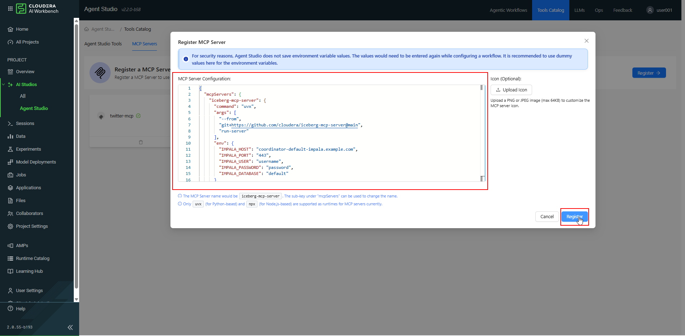

* Wait a few moment to allow verification of the Cloudera MCP server to complete (if it fails initially, try once more). 

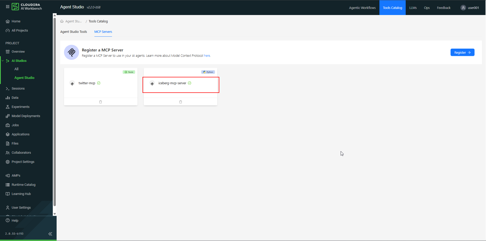

### Step 2: Create a Workflow from the Lab 4 Template

* Click `Agentic Workflows`  in the top navigation pane to return to the Agent Studio home page.

* On the Agent Studio home page, go to the **Workflow templates** area and click `View All`.

* Select the `Lab4: ChatWithCloudera` template to create a draft workflow.

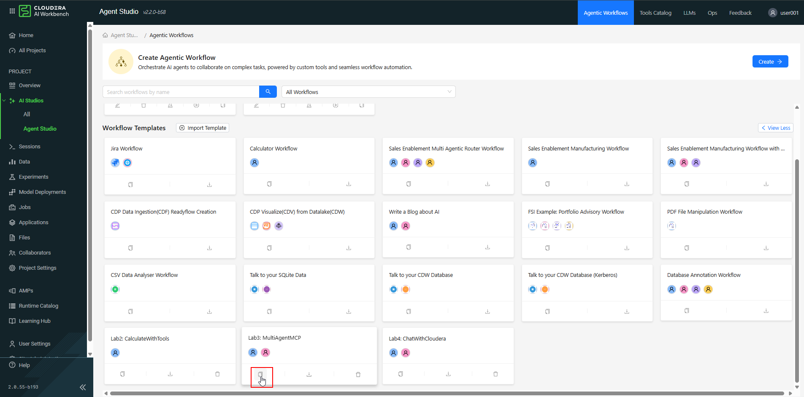

* This will generate a draft workflow from the template as your starting point. 

### Step 3: Enable Conversational Dialogue and Manager Agent

* On the **Add Agents** screen, toggle on **Is Conversational**. This enables a chat interface that retains prior messages as context, allowing for iterative problem solving.

* Toggle on the **Manager Agent** setting, which will oversee the workflow and delegate tasks between your specialized agents. 

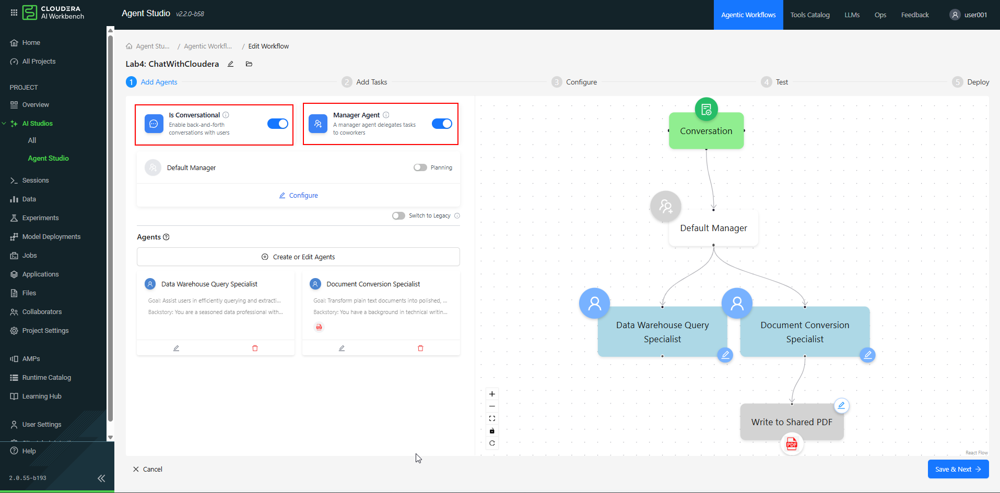

### Step 4: Attach the MCP Server to the Query Specialist

* Locate the **Data Warehouse Query Specialist** agent and click edit.

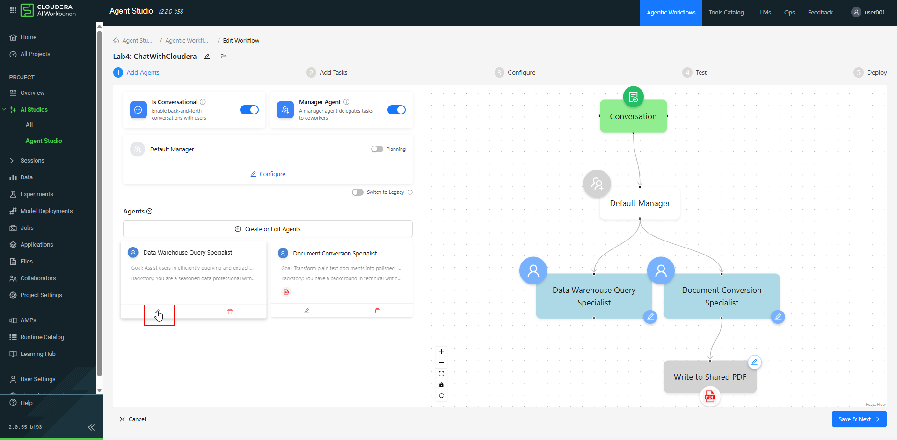

* In the agent editing dialog, click the `Add MCP Server to Agent` button.

* Click the `iceberg-mcp-server` to attach it to the Agent. Then click `Add MCP Server to Agent`.

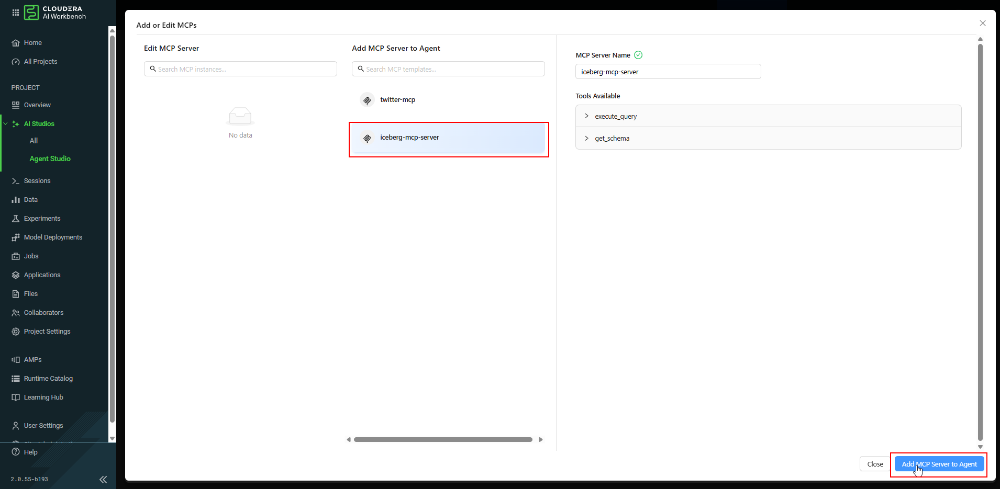

* Close the **Add or Edit MCPs** dialog.

* Click `Save Agent` button. Then Close the **Create or Edit Agent** dialog.

* Click `Save & Next` on the Add Agents menu.

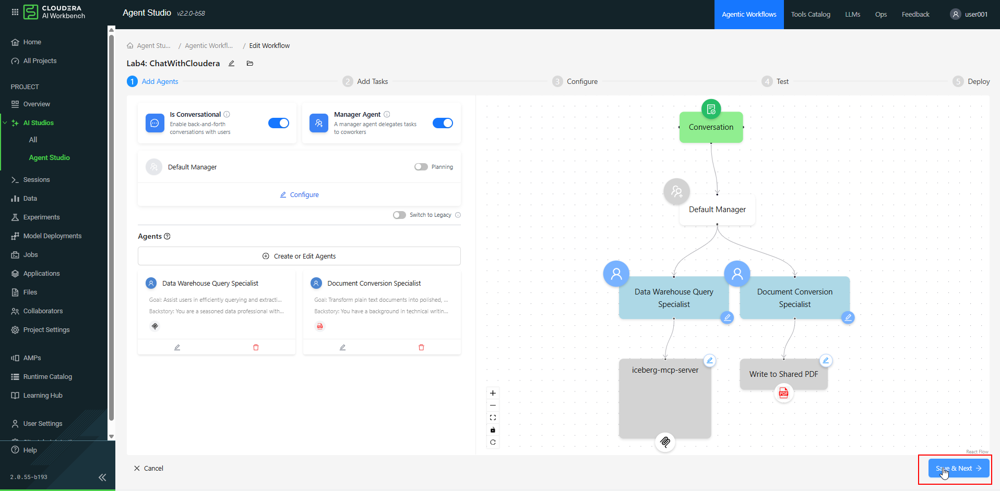

### Step 5: Review Task and Configuration

* No changes are needed in the task configuration screen. Click `Save & Next` to proceed.

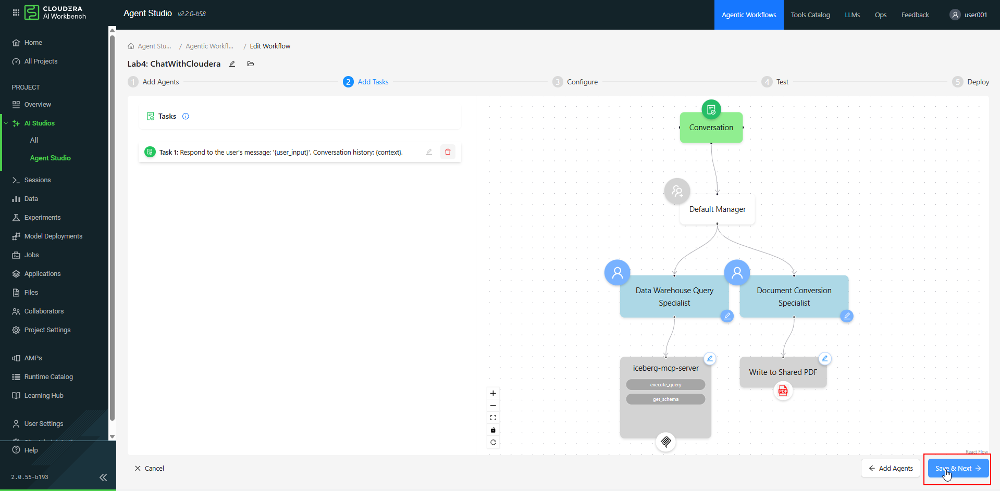

### Step 6: Configure Impala Connection Details

* Proceed to the configuration screen where you will be prompted for Impala connection details.

* Input the details for the Cloudera Data Warehouse provided by your instructor:

   * Impala host: (Enter the coordinator host URL provided)
   * Impala port: `443`
   * Impala user: (Your assigned username)
   * Impala password: (Your assigned password)
   * Database: `default`

* Click `Save & Next`. 

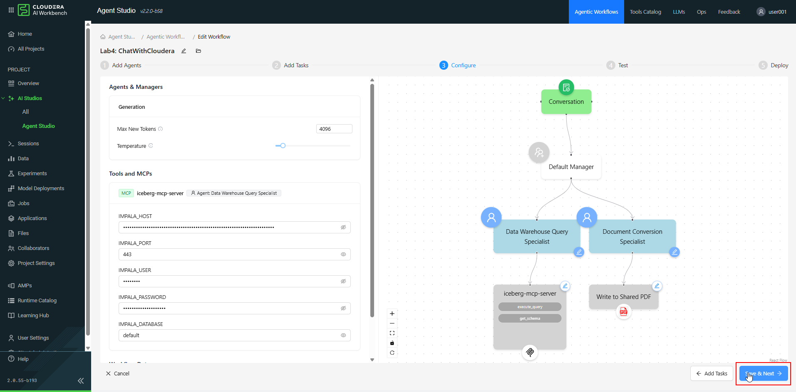

### Step 7: Test Workflow - Database Schema Exploration

* In the chat composer UI, enter your first test prompt: 

```text title="Database Schema Exploration Prompt"
What sort of data do you have?
```

* Watch the execution flow as the data warehouse query specialist interrogates the schema and discovers the users and transactions tables.

* Observe the manager agent providing you with a synthesized summary of the database contents. 


### Step 8: Test Workflow - Complex Query and Report Generation

* Enter a second prompt to engage the full multi-agent team: 

```text title="Query and Report Generation Prompt"
Create a report of the biggest transactions for the top 10 oldest users. Include the transaction amount, the user id, user gender, and the merchant city. Create a PDF with the report using your tools.
```

* Observe the data warehouse query specialist automatically linking the tables, generating the SQL, and modifying the query if it encounters an initial issue.

* Watch the workflow hand off the retrieved data to the document conversion specialist, who will generate a professional-looking PDF containing a title, introduction, data table, and key observations.

* Navigate to the **Artifact Files** tab to locate the generated PDF output. 

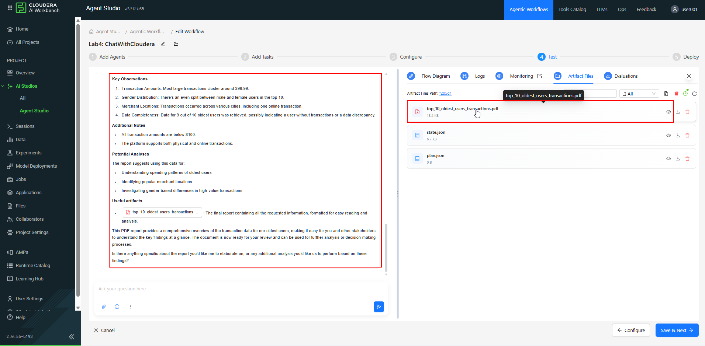

* You can click Cancel on the workflow creation.

**:rocket: We have now concluded Lab 4 :rocket:**

**:tada: Congratulations on completing the Cloudera Agent Studio Hands on Lab! :tada:**


